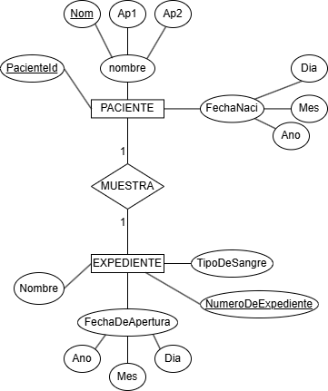
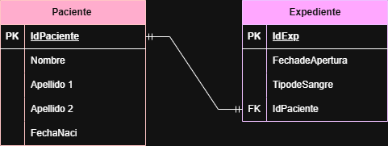
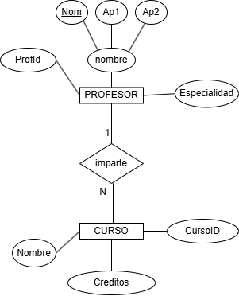
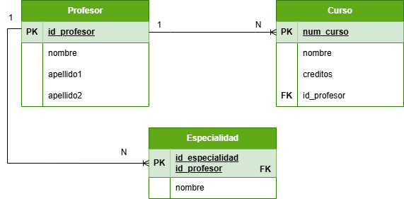
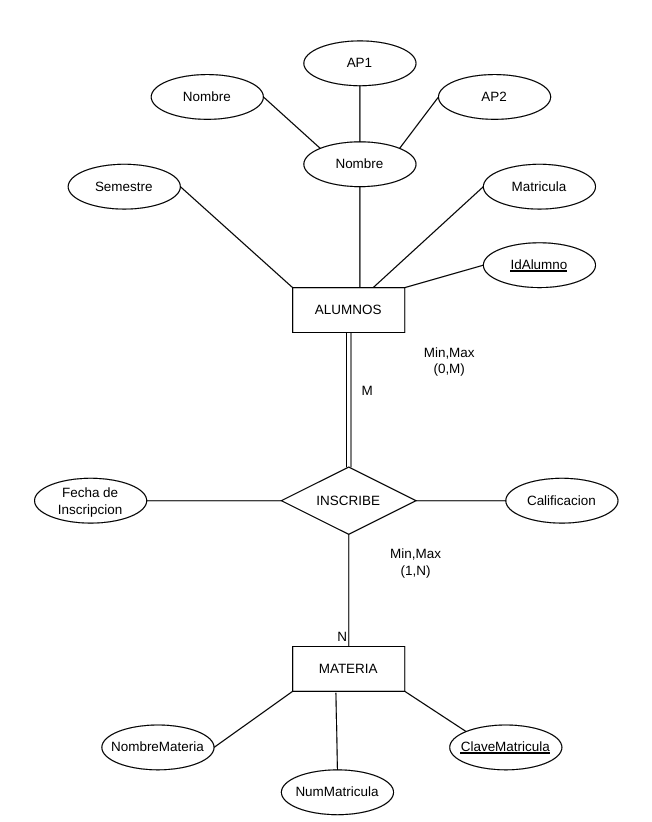
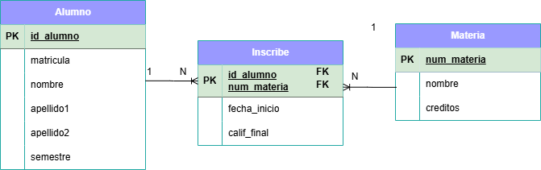
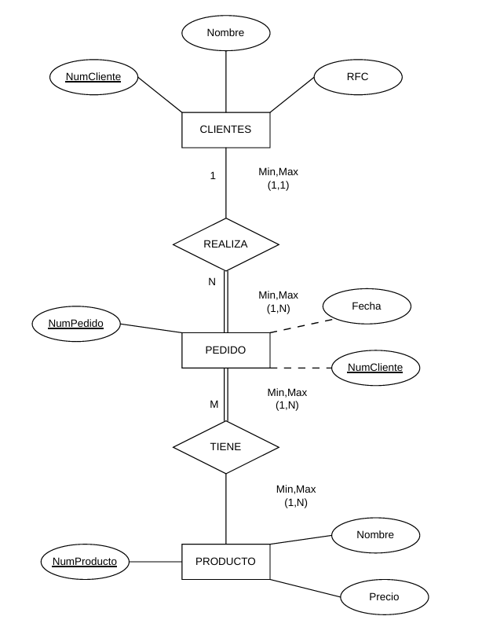
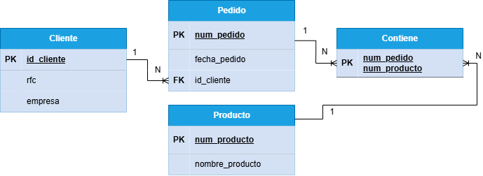
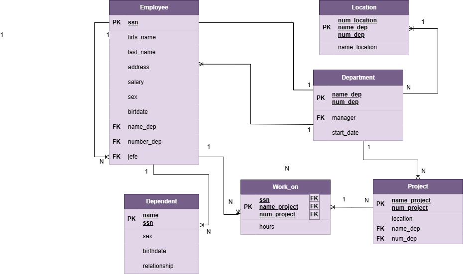
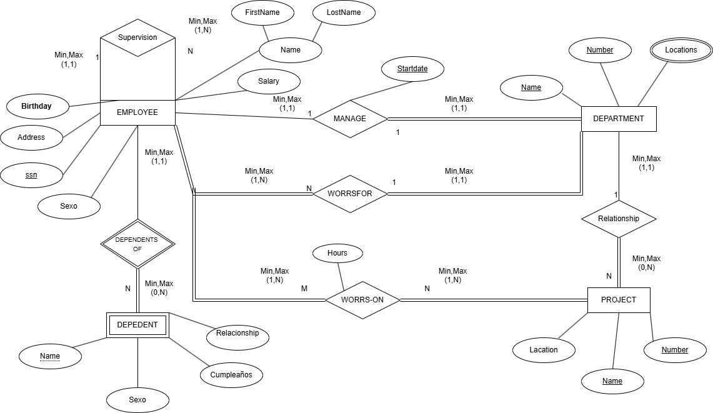

# Ejercicios del Modelo E-R

---

## Ejercicio 1. Hospital

### **Modelo E-R**

### **Modelo Relacional**

---

## Ejercicio 2. Profesor

### **Modelo E-R**

### **Modelo Relacional**

---

## Ejercicio 3. Inscripción

### **Modelo E-R**

### **Modelo Relacional**

---

## Ejercicio 4. Pedidos

### **Modelo E-R**

### **Modelo Relacional**

---

## Ejercicio 5. Departamentos

### **Modelo E-R**

### **Modelo Relacional**

---

## Ejercicio 6. Control Escolar

### **Modelo E-R**

### **Modelo Relacional**
